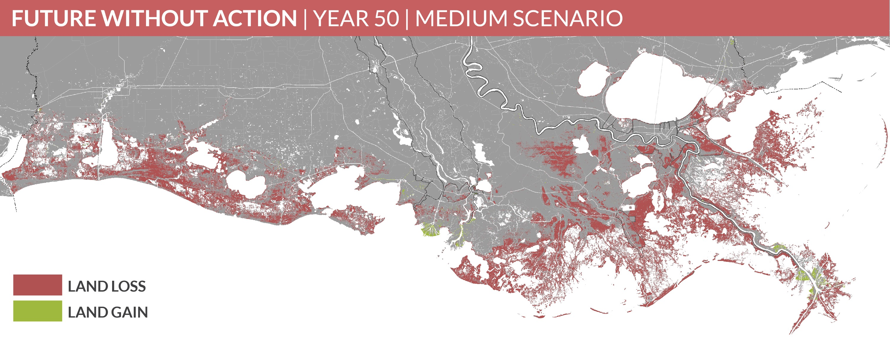
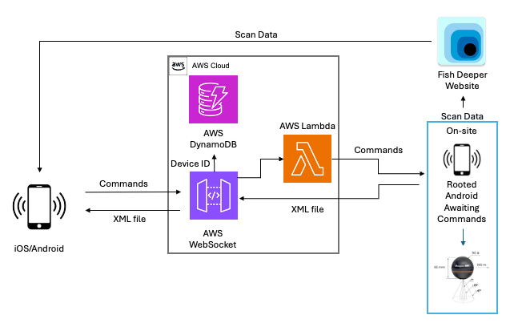
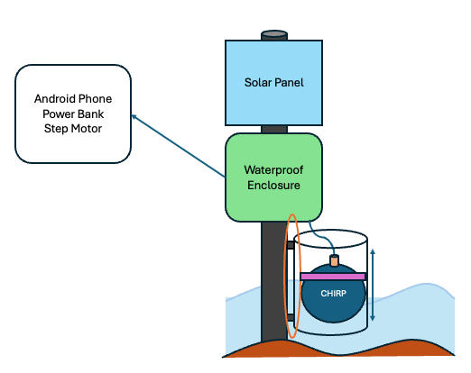
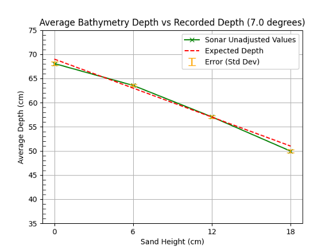
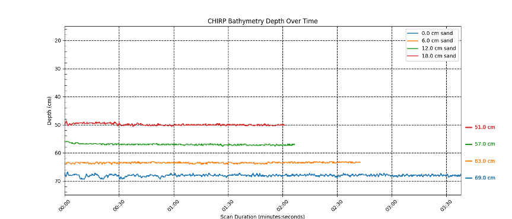
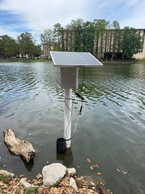
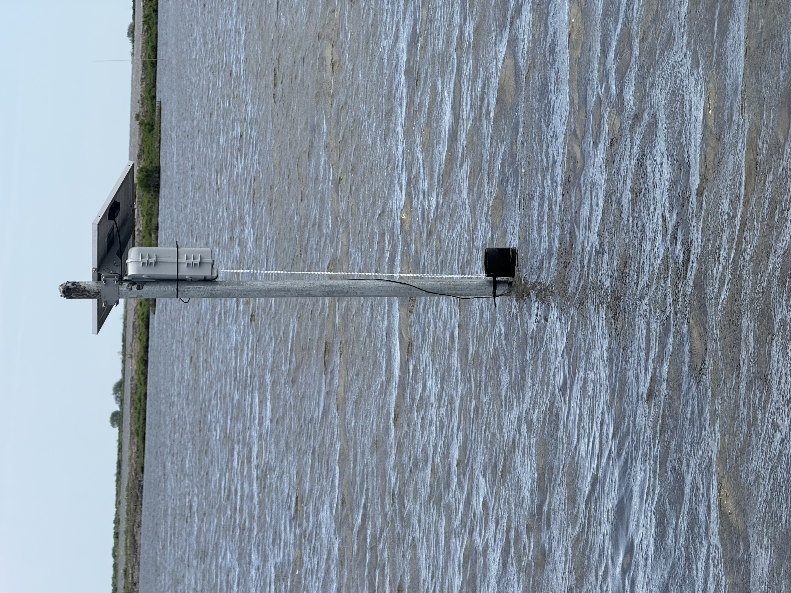

# Chirp

A software-based CHIRP sonar system for tracking mudline elevation in real time during marsh creation dredging on the Louisiana coast.

> Based on the Master's thesis _"Developing a Software-based CHIRP Sonar System to Track Mudline Elevation During Dredging"_ — Ikaika Lee, Department of Computer Science and Engineering, Louisiana State University, Spring 2026.

<p align="center">
  
</p>

## Background

Louisiana lost roughly 2,000 square miles of coastal wetlands between 1930 and 2023, at an average annual cost of $15.2 billion. Without improved intervention, projections estimate another 3,000 square miles lost by 2073, at up to $24.3 billion a year.

Marsh creation projects fight this by pumping dredged sediment into contained areas to build new, elevated land. Today that process is monitored with **Instrumented Settlement Plates (ISPs)** — vibrating wire piezometers and pressure cells that measure soil consolidation. ISPs are accurate, but they have a blind spot: they only produce meaningful data _after_ dredging finishes, and provide no insight into sediment transport or mudline consolidation while dredging is actively happening.



## What this project does

Chirp pairs a commercial CHIRP (Compressed High-Intensity Radiated Pulse) sonar with a cloud-connected control system to close that gap, giving engineers real-time visualization of the mudline as it forms during active dredging. Because CHIRP sonar uses pulse compression, it can filter out the acoustic "noise" of suspended sediment and lock onto the true sediment-water interface, even in high-turbidity slurry.

### Research objectives

1. **Obj1 — System development:** Engineer a cloud-based sonar system, built on a commercial CHIRP transducer, that can be controlled remotely and scan under any field conditions.
2. **Obj2 — Deployment:** Deploy and validate the system in real-world conditions, capturing engineering data during active dredging and zone settling.

## How it works

The sonar hardware itself is a commercial, off-the-shelf transducer with proprietary, closed firmware — it only speaks to its own companion app over Wi-Fi. To make it remotely controllable, Chirp treats a rooted Android phone as a physical proxy: commands sent from a mobile app are translated into simulated taps and swipes (`input tap` / `input swipe`) on the proprietary sonar app, and the phone's UI hierarchy (XML) is captured and streamed back so the controller can confirm state and decide the next action.

```
 ┌────────────┐  commands   ┌────────────┐   WebSocket   ┌─────────────────┐
 │  Flutter    │ ──────────▶ │ AWS Lambda /│ ────────────▶│  Rooted Android  │
 │  mobile app │             │  WebSocket  │               │  on-site device  │
 │ (iOS/Android)│◀──────────│  (AWS Cloud)│◀────────────  │  + CHIRP sonar   │
 └────────────┘  scan data  └──────┬──────┘  XML / scans  └─────────────────┘
                                    │
                                    ▼
                             ┌─────────────┐
                             │  DynamoDB   │
                             │ (device IDs,│
                             │  scan data) │
                             └─────────────┘
```



### Hardware

- Waterproof enclosure with cable glands for all electronics
- CHIRP sonar transducer
- Solar panel + power bank for sustained, self-sufficient field power
- Step motor to raise/lower the sonar in and out of the water (working around the locked firmware)
- Rooted Android phone as the on-site communication gateway



### Software stack

| Layer               | Technology                                     | Purpose                                                                                                                                    |
| ------------------- | ---------------------------------------------- | ------------------------------------------------------------------------------------------------------------------------------------------ |
| Mobile app          | [Flutter](https://flutter.dev)                 | Cross-platform (iOS/Android) app for triggering scans and viewing bathymetry data — see [`chirp_control/`](chirp_control)                  |
| Real-time transport | WebSockets                                     | Persistent, full-duplex channel between the mobile app and the on-site device                                                              |
| Cloud               | AWS (Lambda, API Gateway WebSockets, DynamoDB) | Hosts the WebSocket connection, routes commands, and stores device IDs and scan data — see [`chirp_control/lambda/`](chirp_control/lambda) |
| Data analysis       | Python / Jupyter                               | Post-processing and visualization of bathymetry scan data — see [`data_visualization/`](data_visualization)                                |

## Repository layout

```
chirp/
├── chirp_control/          Flutter mobile app (scan control, live data, settings)
│   └── lambda/              AWS Lambda functions for remote control and sonar command handling
├── data_visualization/      Jupyter notebooks and scripts for processing bathymetry scan data
├── FishDeeperCsvLogs/       Raw CSV scan logs exported from the sonar's companion app
```

## Getting started

The mobile app lives in [`chirp_control/`](chirp_control) — see that directory's README for Flutter setup instructions. Scan data processing notebooks live in [`data_visualization/`](data_visualization).

## Testing & validation

The system was validated in two phases:

1. **Laboratory settling column tests** — a transparent settling column filled with water and site-specific dredged sediment, with the sonar mounted above and facing down, was used to calibrate the system and confirm it could track the mudline as it elevated during settling, even through heavy suspended slurry.
2. **Local field deployment** — the fully assembled system (enclosure, solar power, step motor, and rooted phone) was deployed to validate end-to-end automation and resilience against intermittent cellular connectivity.

| Depth accuracy across sand heights | Mudline tracking over a scan |
| --- | --- |
|  |  |





Results confirmed that sonar visualization of an elevating mudline is possible and that the system is stable enough to be deployed in the field.

## Conclusions & future work

By wrapping a commercial CHIRP sonar in an app-controllable, cloud-connected system, engineers can trigger a scan from anywhere and get real-time mudline data during active dredging — something ISPs alone can't provide. That real-time visibility lets project teams catch fill overruns or underruns as they happen, rather than discovering them after the fact.

Relying on commercial hardware with closed firmware introduced real costs: brittle UI-automation-based control, and communication latency across phone → WebSocket → cloud → phone round trips. The clear next step is custom hardware — a standalone CHIRP transducer wired directly to a microcontroller (e.g. an ESP32 or Raspberry Pi Compute Module) with its own LTE modem — to remove the smartphone middleman entirely, extract raw acoustic backscatter, and cut power draw for longer field deployments.

**Special thanks:** Dr. Celalettin Emre Ozdemir, Dr. Navid H Jafari

