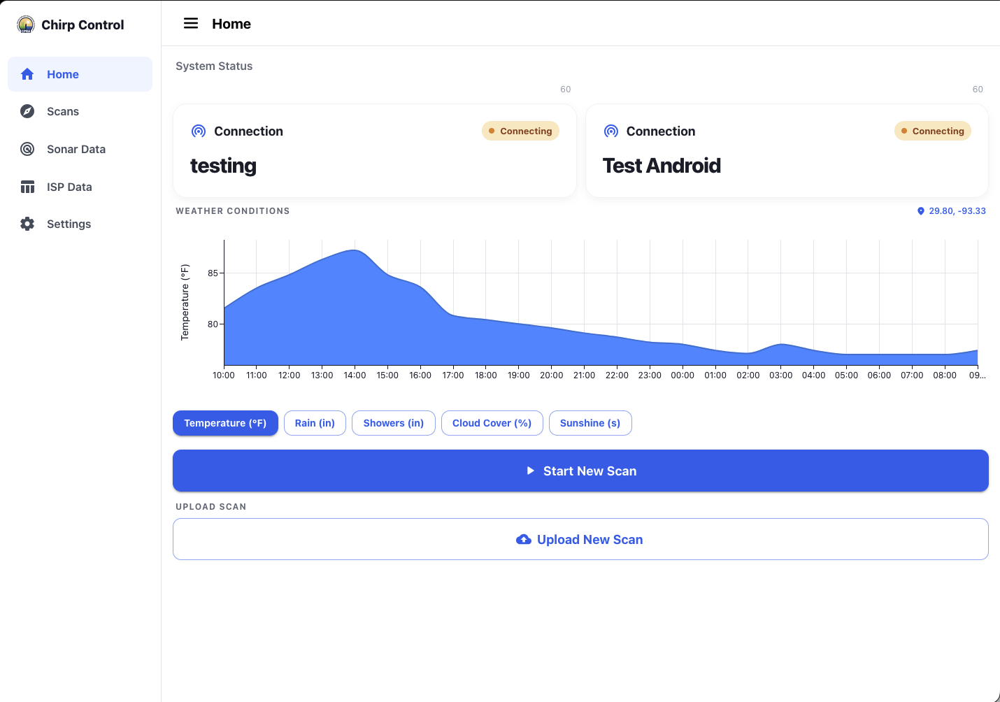
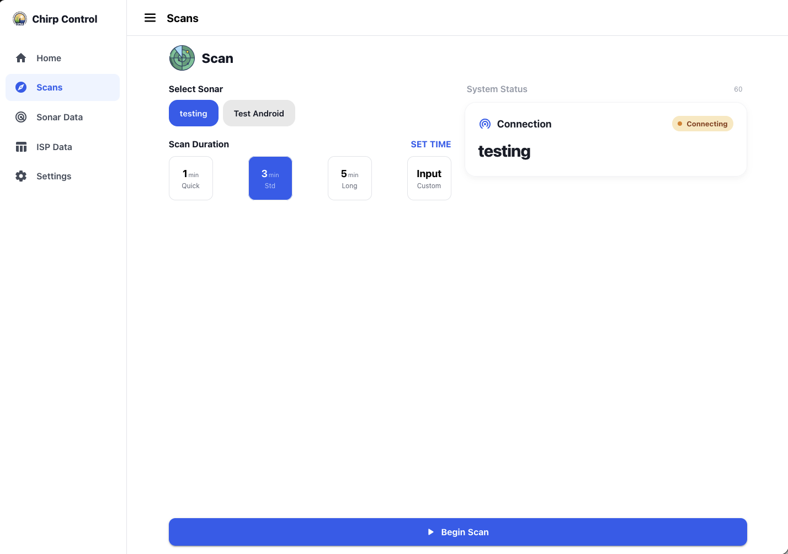
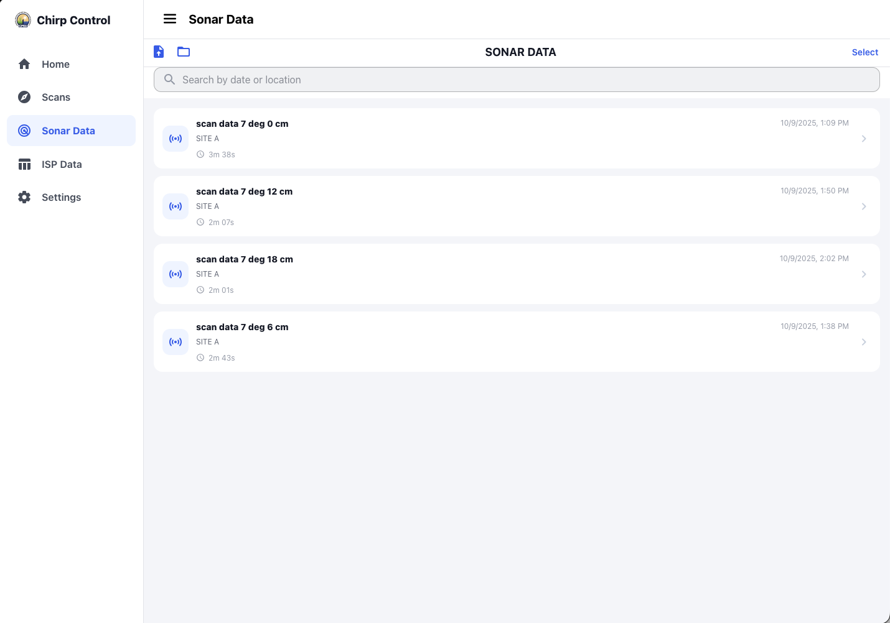
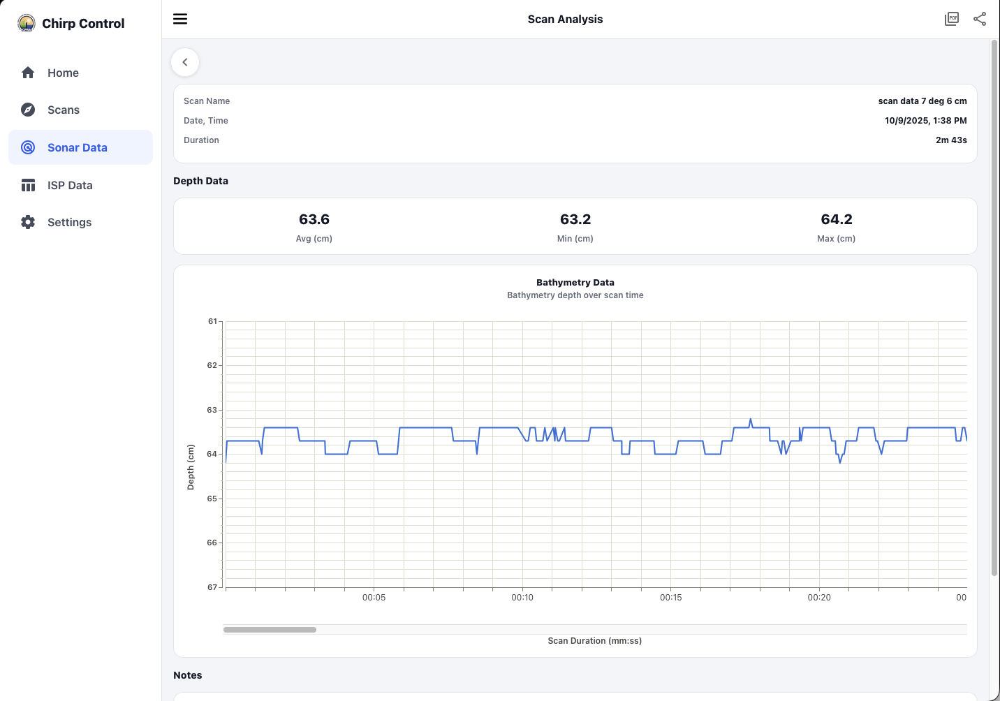
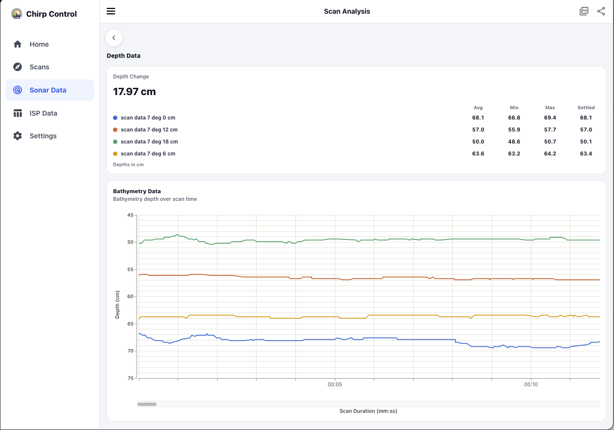
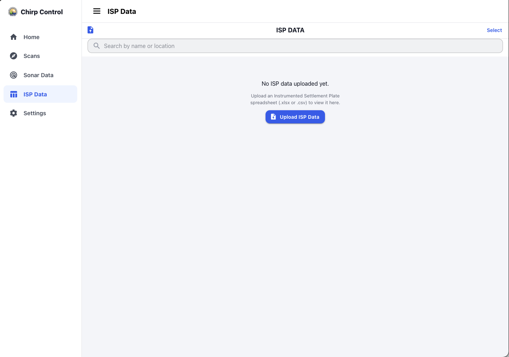
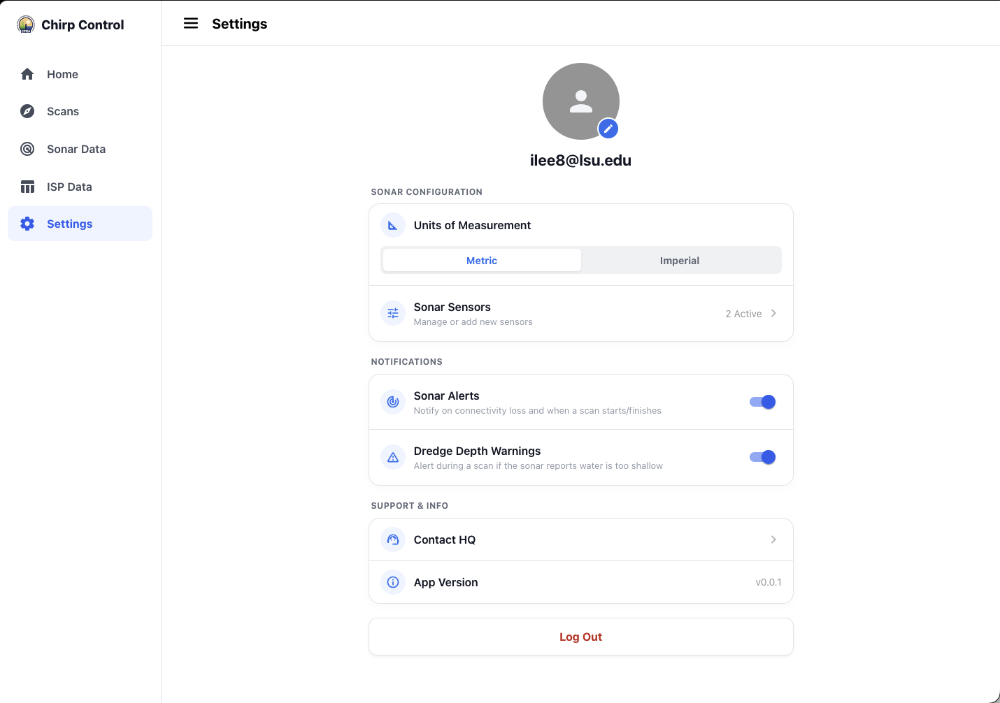

# chirp-control-web

A React web app that provides a browser-based alternative to the Chirp
[mobile app](../chirp_control) for triggering sonar scans, browsing scan
history, and analyzing bathymetry and ISP (Instrumented Settlement Plate)
data. See the [top-level README](../README.md) for background on the
overall Chirp system.

## Features

- **Account login** — email/password auth against the same account Lambda
  used by the mobile app; sessions are cached in `localStorage`.
- **Home** — live system status, weather for the deployment site, and
  starting a scan on a connected sonar.
- **Scan** — drives a scan over a persistent WebSocket connection to the
  on-site rooted Android device, watches for stalls, and surfaces sonar
  alerts/dredge warnings while a scan is in progress.
- **History** — browse, search, rename, delete, and import (a `.zip` or an unzipped scan folder) past
  scans; drill into a single scan or select several to compare.
- **Scan analysis / Compare scans** — depth-over-time charts for one scan
  or several overlaid, with PDF export.
- **Sonar sensors** — register and manage the sonar devices the account can
  control.
- **ISP data** — import ISP spreadsheets (`.xlsx`), browse/search/rename
  imported records, and analyze consolidation readings with charts and
  notes, mirroring the mobile app's ISP workflow.
- **Settings** — unit preference (metric/imperial), alert toggles, and
  account management.

## Screenshots

### Home

System status for each registered sonar, weather conditions for the
deployment site, and shortcuts to start or upload a scan.



### Scans

Pick a registered sonar and a scan duration, then begin a scan over the
WebSocket connection.



### Sonar data

Saved scans for the account, with search, rename, delete, and import from a
`.zip` or an unzipped scan folder. Select several scans to compare them.



### Scan analysis — individual scan

Scan details, average/min/max depth, and a bathymetry depth-over-time chart,
with notes and PDF export.



The PDF export produces a full report. An example is included here:
[scan data 7 deg 12 cm-analysis.pdf](src/assets/scan%20data%207%20deg%2012%20cm-analysis.pdf).

### Scan analysis — comparing scans

Multiple scans overlaid on one chart, with the depth change and per-scan
average, min, max, and settled depth.



### ISP data

Import, search, and analyze Instrumented Settlement Plate spreadsheets.



### Settings

Unit preference, sonar sensor management, alert toggles, and account
actions.



## Tech stack

- [React 19](https://react.dev) + [TypeScript](https://www.typescriptlang.org/)
- [Vite](https://vite.dev) for dev/build tooling, [oxlint](https://oxc.rs) for linting
- [MUI](https://mui.com) (`@mui/material`, `@mui/x-charts`) for UI and charts
- `idb-keyval` for local persistence of ISP records (scans are stored in the backend: DynamoDB + S3)
- `jspdf` + `html-to-image` for PDF report export
- `exceljs` for reading ISP `.xlsx` files
- `jszip` / `pako` for decompressing scan archives and XML payloads
- WebSocket + AWS API Gateway/Lambda for real-time scan control (same
  backend as the mobile app — see [`chirp_control/lambda/`](../chirp_control/lambda))

## Getting started

```bash
pnpm install   # or npm install
cp .env.example .env.local   # then fill in your backend endpoints
pnpm dev       # starts the Vite dev server
```

`.env.local` holds the API Gateway URLs (`VITE_API_BASE_URL` for the HTTP
API, `VITE_WS_URL` for the scan-control WebSocket). It is gitignored; only
`.env.example` is committed.

Other scripts:

```bash
pnpm build     # type-check (tsc -b) and build for production
pnpm lint      # run oxlint
pnpm preview   # preview a production build locally
```

The app talks to an AWS API Gateway/Lambda backend (account auth,
sonar/device registry, scan storage, and the scan-control WebSocket) at the
URLs in `.env.local` — there's no local backend to run. Vite inlines these
values into the built bundle, so they are not secret once the app is
deployed; they're kept out of git so a fork doesn't point at your backend.

## Project layout

```
src/
├── screens/      Top-level views (Home, Scan, History, ScanAnalysis,
│                 CompareScans, SonarSensors, IspData, IspAnalysis,
│                 Settings, Auth)
├── components/   Shared UI (nav bar, charts, status cards)
├── utils/        Data access and integrations: scan/ISP local repos,
│                 auth, WebSocket controller, XML scan-automation
│                 decoding, PDF export, weather, sonar registry
└── notifications/ App-wide snackbar/toast provider
```
