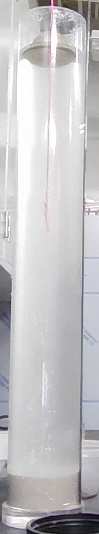
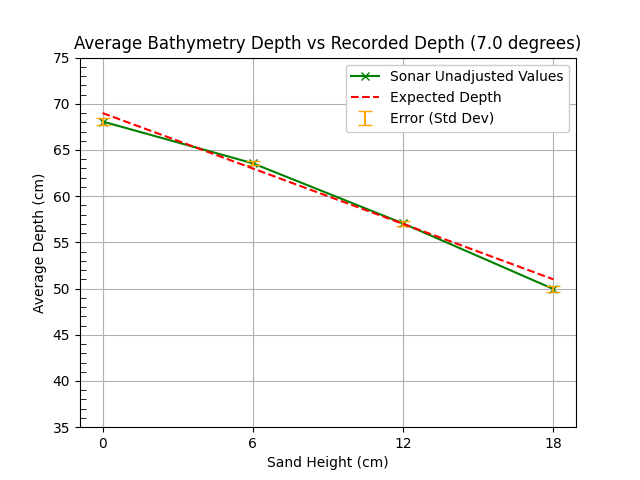
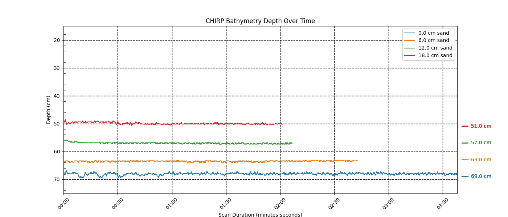
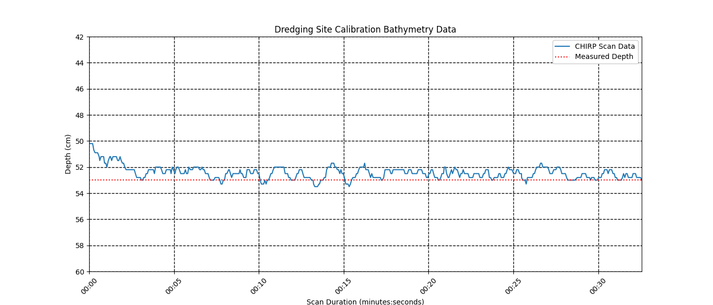

# Tests

## Environment

These tests were performed utilizing a 4 foot settling column with a yard stick taped to the side. The CHIRP sonar was mounted using the included attachment bolts tied with a string, suspending it at a consistent height while keeping it centered in the settling column — equal spacing from each side and a consistent height allowed for accurate measuring and observations.



## Overall Limitations

Because the CHIRP sonar sold by Deeper, which was used in this system, stops scanning when too close to the side or bottom of the settling column it becomes necessary to keep the sonar in the middle of the settling column. This was accomplished using the mounting method described above in "Environment". The method isn't important as long as the CHIRP sonar stays centered in the settling column and at a consistent height for data evaluation.

---

## Purely bathymetry testing without suspended sediment

**Step 1:** Fill settling column with your desired amount of water

> Note: The height of the water must be at least one foot to accomodate for the CHIRP sonar's inability to scan in shallow water.

**Step 2:** Add your desired amount of sand making sure to flatten the sand if possible

> Reminder: The addition of sand will increase the height of the water making it necessary to remove water between each iteration of adding sand to keep the CHIRP height consistent with the water height in step 1.

**Step 3:** Mount the sonar either using the centering method described above in "Environment" (attachment bolts + string) or another method ensuring it stays centered and at a consistent height.

> Note: Remember to record the sonar's scan angle used for this run — it's needed later to name the scan file (see the `scan_degree` naming convention in the "Analyzing Data" section below). The scan angle can be changed via the app and will affect the way the sonar behaves in the tests.

**Step 4:** Perform a scan which should provide an accurate depth reading of the sand in the settling column.

> Note: At the time of writing this the Deeper Max is able to accurately determine the depth without adjustments while the Deeper Sonar PRO+ 2 requires an adjustment of 5 cm to account for the blind spot present in all sonars.

**Step 5:** End the scan, remove the CHIRP sonar from the settling column and repeat steps 2 - 4 until the desired number of tests have been completed. The majority of tests performed in this project used 5 iterations.

---

## Bathymetry tests in the presence of suspended sediment

**Step 1:** Fill settling column with your desired amount of water

> Note: The height of the water must be at least one foot to accomodate for the CHIRP sonar's inability to scan in shallow water.

**Step 2:** Add your desired amount of sand making sure to flatten the sand if possible

> Reminder: The addition of sand will increase the height of the water making it necessary to remove water between each iteration of adding sand to keep the CHIRP height consistent with the water height in step 1.

**Step 3:** Measure the desired amount of silt, clay, or any other lightweight sediment types.

**Step 4:** Add the silt while quickly adding the CHIRP sonar back to the settling column to begin scanning.

> Note: Remember to record the sonar's scan angle used for this run — it's needed later to name the scan file (see the `scan_degree` naming convention in the "Analyzing Data" section below). The scan angle can be changed via the app and will affect the way the sonar behaves in the tests.

> Note: Once scanning is initiated it is likely the CHIRP will be unable to perform any scans right away. This is due to the suspended sediment sitting too close to the sonar as it begins to settle. This should manifest in a "Sonar too shallow" error. This error will only persist for ~1 minute. Following this period of inability to scan the sonar will the begin to detect the suspended sediment affecting the bathymetry readings for 2 - 3 minutes before the suspended sediment settles to the point of accurate measurements. It is recommended to allow the sonar at least 5 minutes when performing tests with suspended sediment to allow for the sediment to settle and accurate measurements to be gathered.

**Step 5:** End the scan, remove the CHIRP sonar from the settling column and repeat steps 2 - 4 until the desired number of tests have been completed. The majority of tests performed in this project used 5 iterations.

---

## A Few Performed Tests

Begin sand at 5 cm, water at 69 cm without chirp and 70 cm with. Pour 200g of silt then begin scans. Chirp is at 70 cm after silt.

- 5 cm sand and 200g silt = ~ 7cm final
- 5 cm sand and 400g silt = ~ 9 cm final
- 5 cm sand and 600g silt = ~10.6 cm final
- 5 cm sand and 800g silt = ~12.4 cm final

---

Begin sand at 1 cm, water at 70 cm with chirp. Pour 200g silt then begin scans. CHIRP at 70 during scans with silt

- 2 cm sand and 200g silt = ~ 4 cm final
- 2 cm sand and 400g silt = ~ 6 cm final
- 2 cm sand and 600g silt = ~ 8 cm final
- 2 cm sand and 800g silt = ~ 10 cm final

---

Begin sand at 2 cm, water at 69 cm with chirp. Pour 200g silt then begin scans. CHIRP at 70 during scans with silt

- 2 cm sand and 200g silt = ~ 4 cm final
- 2 cm sand and 400g silt = ~ 6 cm final
- 2 cm sand and 600g silt = ~ 8 cm final
- 2 cm sand and 800g silt = ~ 10 cm final

---

## Analyzing Data Through data_processing.ipynb

**Step 1:** Create a scans/ folder in the data_visualization folder

**Step 2:** Download scans from the Fish Deeper scans website (https://maps.fishdeeper.com/en-us)

**Step 3:** Unzip and modify the names of the extracted folder to match the expected naming convention

File naming convention:

```
scan_data_{scan_degree}_deg_{sediment_height}_cm
```

Scan degree: Represents the angle of the sound wave cone changing the way it interacts with the environment.

Sediment height: Represents the final observed sediment height in the settling column at the time of testing.

**Step 4:** Move the scans to the scans/ folder

### Folder Layout

`scans/` lives inside `data_visualization/` and can hold multiple renamed scan folders, one per test:

```
data_visualization/
└── data_processing.ipynb/
└── scans/
    ├── scan_data_7_deg_0_cm/
    │   ├── bathymetry.csv
    │   ├── sonar.csv
    │   └── README
    ├── scan_data_7_deg_6_cm/
    │   ├── bathymetry.csv
    │   ├── sonar.csv
    │   └── README
    └── scan_data_7_deg_12_cm/
        ├── bathymetry.csv
        ├── sonar.csv
        └── README
```

Expected: By following the file naming convention the jupyter notebook will provide two graphs for multiple scans. The first graph will be the average depth reading along with the standard deviation. The second graph will be an overlapping timeline of the bathymetry values over time.

#### Average Bathymetry Graph



#### Overlapping Bathymetry Over Time Graph



### Alternate Method

The final cell of the jupyter notebook allows for specifying the details of the graph along with the names of the files to allow for viewing data while ignoring the naming conventions.

#### Independent File Graph


